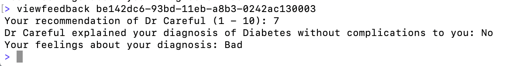

# Patient Appointment Survey

Service for holding data pertaining to patients and their appointments 
and allow patients to respond to surveys about their experience.

## Project Components

* Domain Models ([internal/resources.go](internal/resources.go)) - Definitions of domain models, each generically referred to as a `Resource`.
* Ingestion ([internal/ingest.go](internal/ingest.go)) - Handle ingesting resources from a resource stream.
* Datastore ([datastore/](datastore/)) - Interface for storing and reading resource objects.
  * [neo4j datastore](datastore/neo4j/neo4j.go) implemented using [neo4j driver](https://github.com/neo4j/neo4j-go-driver).
* CLI ([cmd/cli/](cmd/cli/)) - Entry point to CLI for interacting with system.
  * CLI implemented with [cobra](https://github.com/spf13/cobra) and [go-prompt](https://github.com/c-bata/go-prompt).
* REST API ([http/](http/)) - Implementation of REST APIs for interacting with system.
  * REST API implemented using [echo framework](https://github.com/labstack/echo).


## Commands

Main CLI entry and help for available commands:
```shell
go run cmd/cli/main.go help
```

#### Interact with system as a patient:
```shell
go run cmd/cli/main.go patient ...
```

**givefeedback**


**viewfeedback**


**appointments**


#### Ingest data from file
```shell
go run cmd/cli/main.go ingest filepath
```

## Neo4j

Start local container instance:
```
docker run --name testneo4j -p7474:7474 -p7687:7687 --rm -d -v $HOME/neo4j/data:/data -v $HOME/neo4j/logs:/logs -v $HOME/neo4j/import:/var/lib/neo4j/import -v $HOME/neo4j/plugins:/plugins --env NEO4J_AUTH=none neo4j:latest
```

[Browser REPL](http://localhost:7474/browser/)
